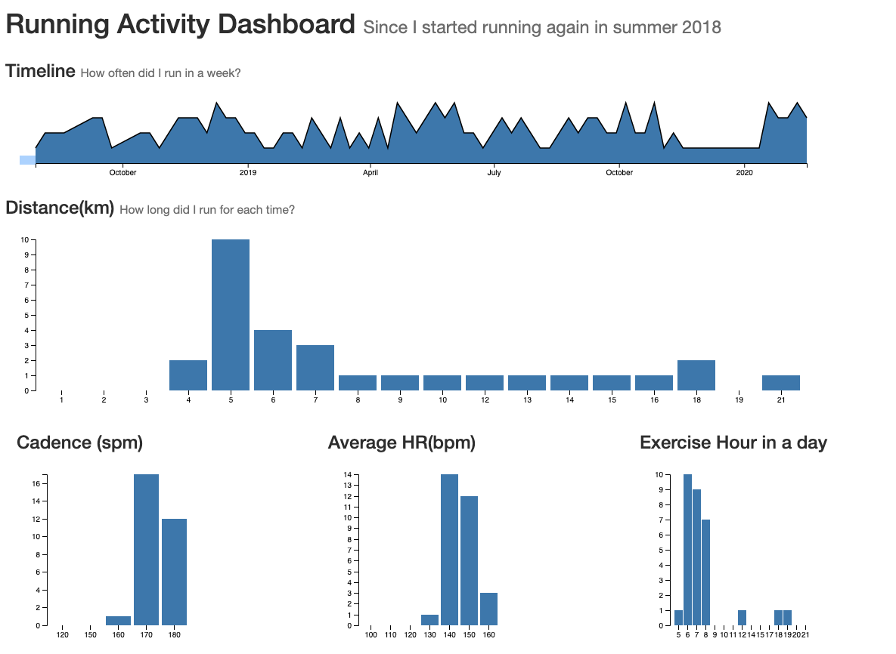

# Running Activity Dashboard

###  About this project
This is a project I worked on for the Master of Information and Data Science (MIDS) - Data Visualization class at UC Berkeley.

### Overview
I used the data from summer 2018 to Feb 2020 to show my recovery progress from back injury.
I show distance, cadence, average HR and exercise hour from the data. 

"Exercise Hour" is not a running metric but I want to check this overtime to see my life rhythm.

### Skills
* d3.js
* data visualization
* Three interactions
 - Crossfilter
 - Brush
 - Tooltip
 
 ### Sample screen capture
 
 
 ### how to run this app
 ```
 python w209.py
 ```
 
